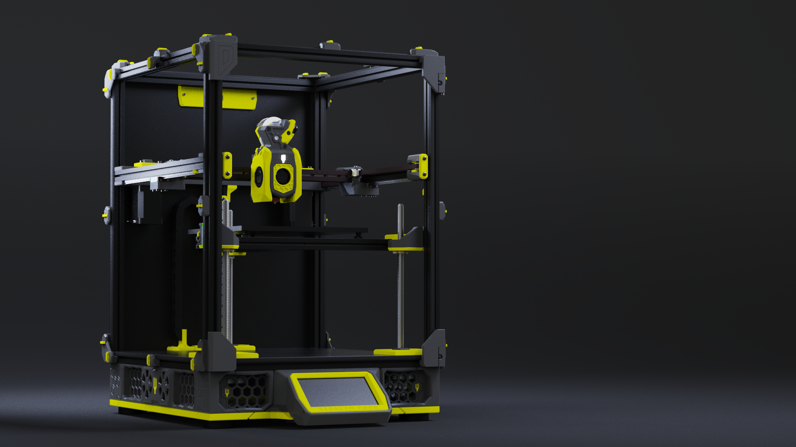

# Stealth Fork (Beta)  

The one where Micron R1 & Salad Fork had a baby...

## About  

Stealth Fork is an experimental design that blends the awesome aesthetic and compact form factor of the [**Micron+ R1**](https://github.com/PrintersForAnts/Micron/tree/main/R1_Beta) with the fixed gantry of the [**Salad Fork**.](https://github.com/PrintersForAnts/Salad_Fork) If you've ever wanted a machine that captures the best aspects of both, this is it.  

This repo is a **work in progress**, and I'll be updating it as things evolve. The goal is to make the build process as seamless as possible while maintaining the high-quality standards of both parent designs.  

## Current Status  

- ✅ **STLs Uploaded** – All required STLs for a **180mm, or 160mm build** are included.  
- 🔜 **CAD Files Coming Soon** – Once the files are cleaned up, they'll be added to the repo. (Skirt CAD files are available)
- ⚠ **Beta Release** – While all parts have been printed successfully, a full machine assembly is still pending. Expect minor refinements.  

---

## Required Parts from Micron R1

Some parts are not included in this repo and need to be pulled directly from the **Micron R1 Repo** to convert your current Salad Fork.

| **Category** | **Micron R1 Repo Link** | **Required Parts** |
|-------------|-----------------|-----------------|
| **Panel Clips & Misc** | [Panels](https://github.com/PrintersForAnts/Micron/tree/main/R1_Beta/STLs/Panels) | All except: Bowden Entry Accent Front Cover, Top Hinge Leaf |
| **X Axis** | [X Axis](https://github.com/PrintersForAnts/Micron/tree/main/R1_Beta/STLs/Gantry/X_Axis) | All |
| **AB Double Shear Mounts** | [AB Drives](https://github.com/PrintersForAnts/Micron/tree/main/R1_Beta/STLs/Gantry/AB_Drives/double_shear_mounts) | All |
| **Front Skirt Display Mounts** | [Skirt Displays](https://github.com/PrintersForAnts/Micron/tree/main/R1_Beta/STLs/Skirts/Displays) | All except: Bezels |

All STLs should be **correctly oriented** for printing.  

---
## BOM

A full BOM will be provided, but for now, the large differences are:

|**Item**|**Qty**|**Link**
|------|------|------|
|Feet|x4|[Ali Express](https://s.click.aliexpress.com/e/_EJ0t67E)
|Waveshare 4.3 Display|x1|[Ali Express](https://s.click.aliexpress.com/e/_EGOmTWc)
|M5x20 BHCS|x4|[Ali Express](https://s.click.aliexpress.com/e/_ExQz6rS)

---

## Feedback & Discussion  

If you're building a Stealth Fork, I'd love to hear your thoughts! Join the discussion, suggest improvements, or share feedback in the **'KyleGB' channel** on the Doomcube Discord.  

---

## Version History

### 19-\mar-23
- Fixed bottom panel DXFs. (Thanks TurtleCrawler)

### 18-Mar-25
- Uploaded bottom panel STLs & DXFs for 180 & 160 

### 15-Mar-25
- Uploaded 160 Skirt STLs
- Uploaded `160_Skirts_v16.step`
- Uploaded `180_Skirts_v24.srep`
- Added missing `Rear_Centre_Skirt_Keystone_x1.stl` (180mm)

### 10-Mar-25
- Initial release of beta STLs  

## Acknowledgements

- HartK for the awesome Micron+
- Yeri for the equally awesome Salad Fork
